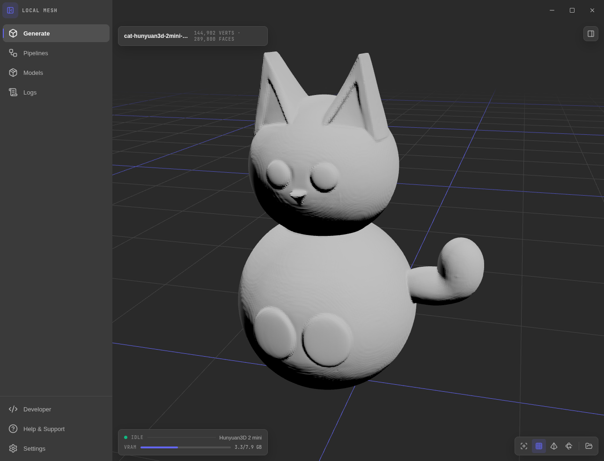

# Local Mesh

**Turn an image into a 3D mesh on your own GPU.** No cloud, no accounts, no
uploads. Local Mesh is a desktop app that sets up the Python side for you,
downloads open models straight from Hugging Face, and runs them through a
node-based pipeline with a live 3D viewer.



## Why

- **One click to a working setup.** The app creates its own Python environment
  with [`uv`](https://docs.astral.sh/uv/), picks the right PyTorch build for
  your card, and installs each model's dependencies. Nothing touches your
  system Python.
- **Any NVIDIA GPU.** From a GTX 1080 to an RTX 5090: setup reads the card's
  compute capability and installs a matching torch. Models are chosen and tuned
  to run in 8 GB of VRAM, so they fly on bigger cards.
- **Pipelines, not dialogs.** Build a generation profile as a small node graph
  (image → background removal → model → clean-up → export) and reuse it. Model
  settings are generated from a registry, so adding a model is a few lines.
- **A real queue.** Drop a folder of images, walk away. One worker keeps the
  model resident between jobs, reports VRAM, frees memory after every run,
  unloads itself when idle, and cancels cleanly.
- **Everything is inspectable.** Three log channels (general, errors,
  generation) in an always-available bottom dock, backed by plain files.

## Models

| Model | Params | VRAM | License | Notes |
|---|---|---|---|---|
| [Hunyuan3D 2 mini](https://huggingface.co/tencent/Hunyuan3D-2mini) | 0.6B DiT | ~5 GB | Tencent Hunyuan Community | Best quality per gigabyte; turbo and standard variants |
| [TripoSR](https://huggingface.co/stabilityai/TripoSR) | ~0.5B | ~4 GB | MIT | Seconds per mesh; great for previews |
| [TripoSG](https://huggingface.co/VAST-AI/TripoSG) | 1.5B | ~7.5 GB | MIT | Near state-of-the-art geometry; tight on 8 GB cards |
| Mock | – | – | – | Procedural mesh, no download, no GPU; exercises the whole path |

## Quick start

Requirements: Node 20+, `git`, [`uv`](https://docs.astral.sh/uv/) on your PATH,
and an NVIDIA driver. Without an NVIDIA GPU the app still runs on CPU torch,
which is fine for the mock and usable for TripoSR.

```bash
npm install
npm run dev
```

Then in the app:

1. **Models → Set up environment.** Once. Downloads torch and the worker's
   dependencies into `~/.local-mesh/env`.
2. **Download weights** and **Install dependencies** on a model card. Weights
   come straight from Hugging Face and need no Python; dependencies go into the
   environment.
3. **Generate → drop an image.** Pick a pipeline, hit Generate, watch the
   queue. The result lands in the viewer and in `~/.local-mesh/outputs`.

Try the **Mock** model first if you want to see the queue, worker and viewer
work end to end before downloading gigabytes.

## The app

- **Generate** — full-screen three.js viewer with a floating dock: pipeline
  picker, image drop zone, job queue with live timers and progress, engine
  panel with VRAM, recent outputs. Mesh tools reduce and smooth a result in
  place, with undo.
- **Pipelines** — the node editor. Image Input, Background Removal, Mesh
  Generator (model and its settings), Post-Process (floaters, degenerate
  faces, decimation), Mesh Export (glb / obj / stl / ply, name pattern).
- **Models** — environment status and setup, per-model weights and
  dependency steps, load and unload.
- **Logs** — bottom dock, `Ctrl+J`. Filter by level, source and text; group
  generation entries by job.
- **Settings** — theme and accent, idle unload, device and precision,
  low-VRAM mode.

## How it works

Everything lives in `~/.local-mesh`: the venv, model snapshots, per-job input
copies, outputs, pipelines and logs. The Electron main process spawns one
long-lived `worker.py` from the venv and talks to it over JSON lines
([protocol](resources/python/PROTOCOL.md)). Backends are small Python modules,
one per model, behind a common `load / generate / unload` interface. The
worker, backends and requirements ship inside the app in
[`resources/python`](resources/python).

```text
src/core/        contracts: IPC, model registry, pipeline graph, worker protocol
src/main/        Electron main: env setup, Hugging Face downloads, worker + queue
src/ui/          React renderer (plain CSS, no UI library)
resources/python worker, backends, requirements, manifest
```

## Adding a model

Add an entry to `src/core/models.ts` (repo, sizes, settings schema), a backend
in `resources/python/backends/`, and a line in `resources/python/manifest.json`
for its requirements and any git repos. The Models view, the node editor's
settings form and the downloader pick it up from there.

## Hardware notes

The reference machine is a GTX 1080 (8 GB, Pascal). Pascal has no bf16 and slow
fp16, so the worker upcasts to fp32 where the weights fit and falls back to
fp16 otherwise. Newer cards get fp16 by default and are simply faster. Model
VRAM figures above are measured for image → shape without textures.

## License

MIT for the app. Each model keeps its own license; see the table above.
