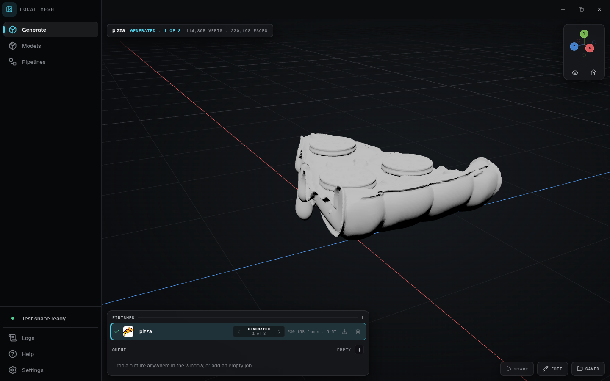

# Local Mesh

**Turn a picture into a 3D mesh on your own graphics card.** No cloud, no
account, nothing uploaded. Drop an image in, press Start, save the result.



## How it works

1. **Install a model.** Open the Models screen, pick one, press *Get the
   model* and then *Set it up*. Local Mesh downloads the weights straight from
   Hugging Face and builds itself a private Python environment with the right
   PyTorch for your card. Nothing touches the rest of your computer, and you
   only do this once per model.
2. **Drop a picture in.** Every image you drop on the Generate screen becomes a
   job in the queue, named after the file. Drop ten and walk away.
3. **Press Start.** Jobs run one after another on your GPU, and each shape
   appears in the viewer as it finishes.
4. **Tidy it up, then save.** Remove floaters, fill holes, reduce, smooth.
   Every edit is a step you can walk back. Save writes a `.glb` (or `.obj`,
   `.stl`, `.ply`) into your outputs folder.

That is the whole app. The knobs an expert might want, such as steps, guidance
and resolution, sit behind a *Quality* picker (Fast / Balanced / Detailed) on
each job, and everything else lives behind an *Advanced* switch in Settings.

## Models

Smallest card first. The Models screen checks each one against the graphics
card it finds and says whether it fits.

| Model | VRAM | License | In short |
|---|---|---|---|
| [TripoSR](https://huggingface.co/stabilityai/TripoSR) | ~4 GB | MIT | A rough shape in seconds. Good for checking a picture works. |
| [Hunyuan3D 2 mini turbo](https://huggingface.co/tencent/Hunyuan3D-2mini) | ~5 GB | Tencent Hunyuan Community | **The one to start with.** Clean shapes, fast, fits an 8 GB card. |
| [Hunyuan3D 2 mini](https://huggingface.co/tencent/Hunyuan3D-2mini) | ~5 GB | Tencent Hunyuan Community | The same model without the shortcut: slower, a little finer. |
| [Hunyuan3D 2 turbo](https://huggingface.co/tencent/Hunyuan3D-2) | ~6 GB | Tencent Hunyuan Community | The full-size model, still quick. |
| [Hunyuan3D 2](https://huggingface.co/tencent/Hunyuan3D-2) | ~6 GB | Tencent Hunyuan Community | The sharpest you can get under 8 GB. |
| [TripoSG](https://huggingface.co/VAST-AI/TripoSG) | ~7.5 GB | MIT | Very sharp; tight on an 8 GB card. |
| [Hunyuan3D 2.1](https://huggingface.co/tencent/Hunyuan3D-2.1) | ~10 GB | Tencent Hunyuan 3D 2.1 Community | The sharpest here. Needs a 12 GB card. |
| [Step1X-3D](https://github.com/stepfun-ai/Step1X-3D) | ~10 GB | Apache-2.0 | Sharp, and free for commercial use. Needs a 12 GB card. |
| [TRELLIS](https://github.com/microsoft/TRELLIS) | ~16 GB | MIT | A different approach that fails on different images. Needs a 16 GB card. |

There is also a **Test shape** behind the Advanced disclosure on the Models
screen: it makes a simple mesh instantly, with nothing to download and no GPU,
so you can see the queue and the viewer work before committing to gigabytes.

## Requirements

- An NVIDIA graphics card with 4 GB or more of memory, from a GTX 1080 up to an
  RTX 5090. Setup reads the card and installs a matching PyTorch. Without one
  the models run on the CPU, which works for the small ones but takes minutes.
- [`uv`](https://docs.astral.sh/uv/) and `git` on your PATH. The Models screen
  tells you if either is missing.
- To run from source: Node 20 or newer.

```bash
npm install
npm run dev      # Vite dev server + Electron, hot reload
npm run build    # typecheck + bundle to dist/ and dist-electron/
npm start        # Electron against the production build
```

## For power users

**Pipelines.** A node editor for changing how a mesh is made, step by step:
image → background removal → model → clean-up ops in any order → export. It
appears in the sidebar after your first mesh, or from Settings → Advanced. A
job can run a saved pipeline instead of a model.

**Settings → Advanced.** Idle unload, device, precision and low-VRAM mode. The
defaults pick themselves per machine: fp32 on Pascal cards (no bf16, slow
fp16), low-VRAM mode on when the card has less than twice what the model needs.

**Logs.** `Ctrl+J` opens three channels (general, errors, generation) in a
dock at the bottom of the window, backed by plain files in `~/.local-mesh/logs`.

## Under the hood

Everything lives in `~/.local-mesh`: the Python environment, model weights,
each job's input copy and unsaved revisions, saved outputs, pipelines and logs.
The Electron main process spawns one long-lived `worker.py` from the
environment and talks to it over JSON lines
([protocol](resources/python/PROTOCOL.md)). The worker keeps a model resident
between jobs, reports memory, cancels cleanly and unloads itself when idle.
Backends are small Python modules, one per model, behind a common
`load / generate / unload` interface, and they ship inside the app in
[`resources/python`](resources/python).

```text
src/core/         contracts: IPC, model registry, pipeline graph, worker protocol
src/main/         Electron main: env setup, Hugging Face downloads, worker + queue
src/ui/           React renderer (plain CSS, no UI library)
resources/python  worker, backends, requirements, manifest
```

**Adding a model** is an entry in `src/core/models.ts`, a backend in
`resources/python/backends/` with its line in `backends/registry.py`, an entry
in `resources/python/manifest.json`, and a bump of `resources/python/VERSION`.
The Models screen, the job settings and the downloader pick it up from there.

## License

MIT for the app. Each model keeps its own license; see the table above.
